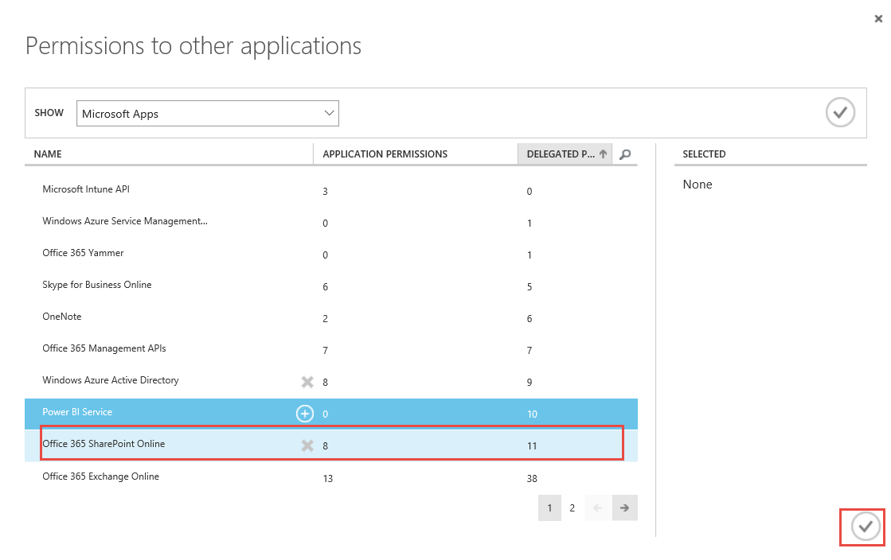
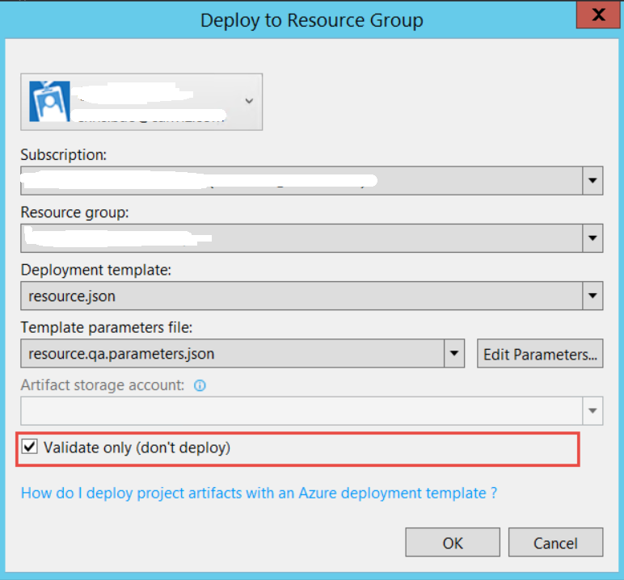
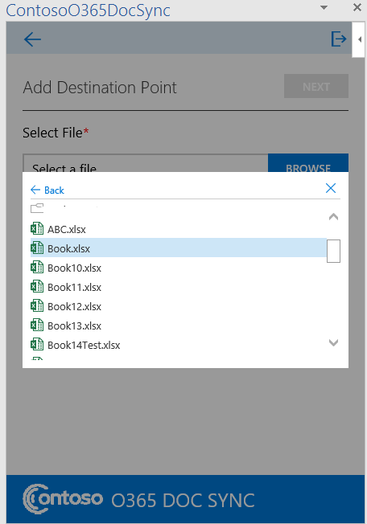
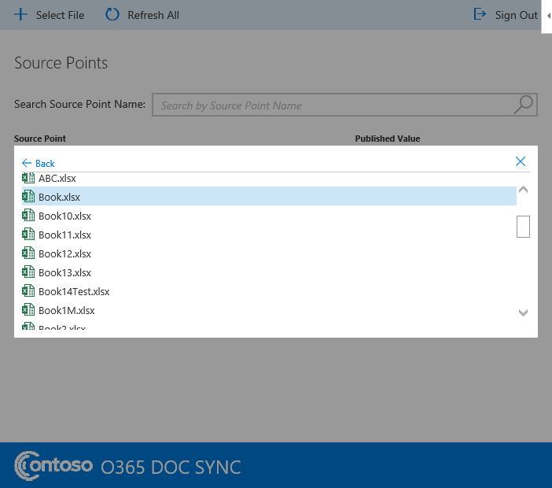

Contoso O365 Doc Sync Code Sample

**Table of Contents**

[Prerequisites](#prerequisites)

[Register the application in Azure Active Directory for MVC Web App](#register-the-application-in-azure-active-directory-for-mvc-web-app)

[Register the application in AAD for WebJob](#register-the-application-in-aad-for-webjob)

[Create Azure resources using ARM template](#create-azure-resources-using-arm-template)

[Configure the communication between WebJob and O365 tenant](#configure-the-communication-between-webjob-and-o365-tenant)

[Deploy the sample to Azure](#deploy-the-sample-to-azure)

[Encrypt string](#encrypt-string)

[Upload the Add-in manifest file](#upload-the-add-in-manifest-file)

[Install Excel Add-in](#install-excel-add-in)	

[Install Word Add-in](#install-word-add-in)

[Install PowerPoint Add-in](#install-powerpoint-add-in)

[Run Excel, Word & PowerPoint Add-ins](#run-excel-word-powerpoint-add-ins)

[How to view Azure SQL data?](#how-to-view-azure-sql-data)

[How to view data in the storage account?](#how-to-view-data-in-the-storage-account)

[How to check WebJob status?](#how-to-check-webjob-status)

[Build and debug locally](#build-and-debug-locally)

[Understand the code](#understand-the-code)

[Questions and comments](#questions-and-comments)

[Contributing](#contributing)

## Prerequisites

**Deploying and running this sample requires**:

1. An Azure subscription with permissions to register a new application, and deploy the Web App.
2. You have an O365 account and you could contact your admin to consent the permission to access it.
3. Visual Studio 2015 (any edition), [Visual Studio 2015 Community](https://go.microsoft.com/fwlink/?LinkId=691978&clcid=0x409) is available for free and ensure Latest Microsoft Office Developer Tools for Visual Studio 2015 is installed.
4. Make sure you have [Outlook 2016](https://products.office.com/en-US/outlook/email-and-calendar-software-microsoft-outlook) installed.
5. Familiarity with C#, .NET Web applications, JavaScript programming. 

## Register the application in Azure Active Directory for MVC Web App

1. Login the Azure AD using your O365 account. ([`https://portal.azure.com`](https://portal.azure.com)) 

2. Click *App Registrations* on the left navigation and then click + New application registration button.

   

3. In the Add Application wizard, enter a name of SmartLink.Web and choose the type Web Application and/or Web API. Click the arrow to the next page of the wizard.

4. In the App Properties page, enter a SIGN-ON URL
   
   `https://<websitename>.azurewebsites.net` For example: `https://msfincontosoo365docsyncd.azurewebsites.net`
    
   > Note: Sign-ON URL is the URL where you can sign in and use your app. 

5. Click Create to create the registration.
 
6. Go back the App registrations page when the application created successfully.

10. Search the application name and then click it. 

   

11. Store the copied client secret.

     - On the application, click *CONFIGURE* in the tabs menu.

     - Find the *Keys* and select the *duration* for the key then click *save* at the bottom.

       

     - Store the copied client secret.

       

12. Store the application client ID

    - On the application,  click on *CONFIGURE* in the tabs menu.
    - Search & copy the Client ID value and store it.


## Register the application in AAD for WebJob

1. Follow [Register the application in AAD for MVC Web App](#register-the-application-in-azure-active-directory-for-mvc-web-app) section to register another app named *contosoo365docsync.webjob* and please refer to the table below when filling the value. 

| SIGN-ON URL    | https://[websitename].azurewebsites.net  |
| -------------- | ---------------------------------------- |
| **App ID Uri** | **https://[your-domain].onmicrosoft.com/<webjobname>** |

2. Click the CONFIGURE in the tabs menu and click *Add application*.

   

3. Select *Office 365 SharePoint Online* and save it.

   

4. Here is the O365 SharePoint Online app permission needed for the Azure AD App *contosoo365docsync.webjob*.


## Create Azure resources using ARM template

1. Download the project and using visual studio 2015 to open it.

2. Right click on the Azure resource group project *ContosoO365DocSync.Azure* and click *Deploy* | *New*.

   

3. Fill the Azure login account and create a new resource group (**For example:**
   *ContosoO365DocSync.QA*) then select the resource parameter json file (**For example:** *resource.qa.parameters.json*) & edit the parameter.

   

4. After clicking *Edit Parameters* and please fill the parameters below.

   

   > **Note:** Please select the checkbox to store the password as plain text in the parameters file.

   | **Parameter Name**            | **Value**                                | **Note**                                 |
   | ----------------------------- | :--------------------------------------- | ---------------------------------------- |
   | webSiteName                   | <WebSiteName>  **For example:** *ContosoO365DocSyncQAWebApp* |                                          |
   | sqlserverName                 | <SQLServerName>  **For example:**  *ContosoO365DocSyncQASQL* | The SQL Server name                      |
   | hostingPlanName               | <hostingPlanName>  **For example:**  ContosoO365DocSyncQAHostPlan | The name of the App Service plan to use for hosting the Web App. |
   | skuName                       | <skuName>  **For example: **  F1         |                                          |
   | skuCapacity                   | <skuCapacity>  **For example:**  1       | sets number of workers for this App Service plan SKU |
   | administratorLogin            | **For example:**  ContosoO365DocSyncLogin         | This login is used to login to the SQL database. |
   | administratorLoginPassword    | **For example:** contosoo365docsync@qa            |                                          |
   | databaseName                  | **For example:**  contosoo365docsyncQA            | The database name hosted on the SQL Server |
   | collation                     | Leave it as is.                          |                                          |
   | edition                       | **For example:** basic                   | Specifies the edition for the database. Valid values are:   -- Default  -- None  -- Premium  -- Basic  -- Standard |
   | maxSizeBytes                  | Leave it a is                            |                                          |
   | requestedServiceObjectivename | **For example:** basic                   | performance level                        |
   | storageAccountType            | **For example:**  Standard_LRS           |                                          |
   | storageAccountName            | **For example:**  ContosoO365DocSyncQA            |                                          |
   | appInsightName                | **For example:**  contosoo365docsyncqa       |                                          |

5. Validate and hit Ok.

   

6. Uncheck the *Validate only* checkbox and then hit OK to create the Azure resources.

   | **Resource Name**  | **Resource Type**   | **Pricing Level** | **Resource Group**                       |
   | ------------------ | ------------------- | ----------------- | ---------------------------------------- |
   | WebSiteName        | App Service         | F1                | Resource group created in the step 3 above. |
   | SQLServerName      | SQL Server          | N/A               | Same as above                            |
   | databaseName       | SQL database        | basic             | Same as above                            |
   | storageAccountName | Storage  account    | LRS               | Same as above                            |
   | WebSiteName        | Application insight | basic             | Same as above                            |

   ​

## Configure the communication between WebJob and O365 tenant

1. Create self-certificate.

   - Execute the following command to create the self-certificate. 

     `makecert -n "CN=MyCompanyName MyAppName Cert" -ss my -len 2048 -r -pe `

   - Go to the personal certificate store under current user. 

   - Export the CER certificate with base 64 encoded X.509.

     

   - Execute the following PowerShell command.

     ```powershell
     $cer = New-Object System.Security.Cryptography.X509Certificates.X509Certificate2
     $cer.Import("<absolute path of the CER file> Example c:\mycert.cer>") 
     $bin = $cer.GetRawCertData()
     $base64Value = [System.Convert]::ToBase64String($bin)
     $bin = $cer.GetCertHash()
     $base64Thumbprint = [System.Convert]::ToBase64String($bin)
     $keyid = [System.Guid]::NewGuid().ToString()
     ```

   - Store the base64Value; $base64Thumbprint; keyid that will be used in other places.

     > **Note:** **If MAKECERT is not available, please download the Windows SDK and install the tool only in the screenshot below.**

     [https://www.microsoft.com/en-us/download/confirmation.aspx?id=8279](https://www.microsoft.com/en-us/download/confirmation.aspx?id=8279)

     

2. Export PFX certificate

   - Export the PFX certificate from the self-certificate
   - Store the password when exporting the PFX certificate.
   - Store the PFX certificate. 

3. Download the project & include the certificate. 

   - Open the solution.
   - Include the PFX certificate in ContosoO365DocSync.WebJob project. 
   - Include the PFX certificate in ContosoO365DocSync.DocumentWebJob project.

   **For example:** contosoo365docsync.pfx.

4. Configure the app settings in Azure portal

   - Go to the application settings.

   - Locate the App settings node.

     

   - Fill the following app settings.   

   | **App  setting **   | **Value**                                | **Notes**                                |
   | ------------------- | ---------------------------------------- | :--------------------------------------- |
   | InstrumentationKey  | Application Insight Instrumentation key. | Find it in the application insights      |
   | ida:WebJobClientId  | The application ID of the AAD App for WebJob | Find it in the AAD App for WebJob.       |
   | CertificatePassword | The password when exporting the certificate | Step 2 in this [section](#configure-the-communication-between-webjob-and-o365-tenant) |
   | ida:AADInstance     | [https://login.microsoftonline.com/](https://login.microsoftonline.com/) | Fixed value                              |
   | ida:TenantId        | The Azure Tenant ID                      | Step 9 in this [section](#register-the-application-in-azure-active-directory-for-mvc-web-app) |
   | SharePointUrl       | The root site collection of the O365    site | **For example:**  [https://yourtenant.sharepoint.com](https://yourtenantsharepoint.com) | 
   | Key						| 18, 7, 19, 11, 24, 226, 85, 45, 88, 184, 27, 162, 37, 112, 183, 209, 241, 24, 175, 176, 176, 53, 196, 29, 24, 26, 17, 218, 131, 236, 53, 55 | Encrypt key, this is fixed value
   | CertificateFile     | web site relative path                   | **For example:**  contosoo365docsync.pfx        | 

   - Update the following connection settings.      

   | **Connection  setting **   | **Value**                                | **Notes**                                |
   | ------------------- | ---------------------------------------- | :--------------------------------------- |
   | AzureWebJobsDashboard  | The Azure web job dashboard connection string. | Encrypt it in this [section](#encrypt-string) |
   | AzureWebJobsStorage  | The Azure web job storage connection string | Encrypt it in this [section](#encrypt-string) |


5. Update the manifest file.

   - Download the manifest file from the AAD App for the WebJob.
   - Edit XXX following the template below
   - Upload the manifest file

| **Key**             | **Value**         | **Notes**                                |
| ------------------- | ----------------- | ---------------------------------------- |
| customKeyIdentifier | $base64Thumbprint | Step 1.5 in this [section](#configure-the-communication-between-webjob-and-o365-tenant). |
| keyId               | $keyid            | Step 1.5 in this [section](#configure-the-communication-between-webjob-and-o365-tenant). |
| value               | $base64Value      | Step 1.5 in this [section](#configure-the-communication-between-webjob-and-o365-tenant) |


## Deploy the sample to Azure

1. Open the project using visual studio 2015 if you already download it. 
2. Update the configuration settings in the table below.

| App Setting               | Value                                 | Note                                     |
| ------------------------- | ------------------------------------- | ---------------------------------------- |
| ida:clientID              | GUID                                  | Step 10 in this [section](#register-the-application-in-azure-active-directory-for-mvc-web-app) |
| ida:clientSecret          | String                                | Step 11 in this [section](#register-the-application-in-azure-active-directory-for-mvc-web-app) |
| ida:TenantID              | GUID                                  | Step 9 in this [section](#register-the-application-in-azure-active-directory-for-mvc-web-app) |
| ida:domain                | yourtenantname.onmicrosoft.com        |                                          |
| ida:PostLogoutRedirectUri | https://websitename.azurewebsites.net | Azure web site URL                       |
| ResourceId                | https://graph.microsoft.com           | this is fixed value                      |
| SharePointUrl           	| https://yourtenantname.sharepoint.com | The root site collection of the O365 site             
| Key						| 18, 7, 19, 11, 24, 226, 85, 45, 88, 184, 27, 162, 37, 112, 183, 209, 241, 24, 175, 176, 176, 53, 196, 29, 24, 26, 17, 218, 131, 236, 53, 55 | Encrypt key, this is fixed value      


3. Right click on *ContosoO365DocSync.Web* and then select *'Publish'*

4. A *Publish* popup will be displayed.

5. Click on *Microsoft Azure App Service.*

6. Sign in with Azure account and select the Azure website then click '*Next*'

7. Select Web Deploy and then click *'Next'*

8. Select Debug and click *'Next'*

   

9. Click *'Publish'*


## Encrypt string

1. Open the project using visual studio 2015 if you already download it.

2. Set ContosoO365DocSync.EncryptTool as StartUp project, and press F5.

3. A encrypt tool window will be displayed.

4. Encrypt string

	- Enter the source string
	
	- Click encrypt string button
	
	- Copy and store the encrypted string
	
	  	


## Upload the Add-in manifest file

1. Go to the app for Office add-in management page. 

   **For example:** `https://<tenantname>.sharepoint.com/sites/AppCatelog/AgaveCatalog/Forms/AllItems.aspx` 

2. Click *'Upload'*

   

3. Find the [app manifest file](ContosoO365DocSyncExcel/ContosoO365DocSyncExcelManifest/ContosoO365DocSyncExcel.xml).

4. Update the manifest file.

   - Update the Id with a new generated GUID and you could refer to the link below on how to generate it. [https://guidgenerator.com/online-guid-generator.aspx](https://guidgenerator.com/online-guid-generator.aspx) 

     > Note: please generate new GUID for the Word manifest file.

   - Update the display name and description default value to ContosoO365DocSync. 

   - Update the icon url default value to the one provisioned in Azure.

	 **For example:** `[https://<yourwebsitename>.azurewebsites.net/Images/logo.png](https://<yourwebsitename>.azurewebsites.net/Images/logo.png)`   

   - Update the hosts to the following elements.
   	
	```
	<Host Name="Workbook" />
    <Host Name="Document" />
    <Host Name="Presentation" />
	
	```
   
   - Update the source location default value to the one provisioned in Azure.

     **For example:** `[https://<yourwebsitename>.azurewebsites.net/Home/Index](https://<yourwebsitename>.azurewebsites.net/Home/Index)` 

     

5. Upload manifest file *ContosoO365DocSyncExcel.xml* to the SharePoint catalog.

## Install Excel Add-in

1. Open Excel 2016.

2. Sign in with your O365 account. 

3. Click *File* | *Options*

   

4. Click Trust Center | Trust Center settings.

   

5. Click *Trusted Add-in Catalogs* | Add catalog URL.

   **For example:** `https://<tenantname>.sharepoint.com/sites/AppCatelog`

   

6. Restart the Excel.

7. Click *Insert* and *My Add-ins*

   

8. Click *MY ORGANIZATION* and insert the *ContosoO365DocSync*. 

   

9. Then the Excel Add-in would be shown on the task panel.

   

## Install Word Add-in

1. Open Word 2016

2. Sign in with your O365 account. 

3. Click *File* | *Options*

4. Click *Trust Center* | *Trust Center settings*.

   

5. Click *Trusted Add-in Catalogs* | Add catalog URL

   **For example:** `https://<tenantname>.sharepoint.com/sites/AppCatelog`

6. Restart Word.

7. Click *Insert* and *My Add-ins*.

8. Click *MY ORGANIZATION* and insert the *ContosoO365DocSync*.

9. Then the Word Add-in would be shown on the task panel.


## Install PowerPoint Add-in

1. Open PowerPoint 2016

2. Sign in with your O365 account. 

3. Click *File* | *Options*

4. Click *Trust Center* | *Trust Center settings*.

   

5. Click *Trusted Add-in Catalogs* | Add catalog URL

   **For example:** `https://<tenantname>.sharepoint.com/sites/AppCatelog`

6. Restart PowerPoint.

7. Click *Insert* and *My Add-ins*.

8. Click *MY ORGANIZATION* and insert the *ContosoO365DocSync*.

9. Then the PowerPoint Add-in would be shown on the task panel.


## Run Excel, Word & PowerPoint Add-ins

1. Work with your O365 admin to go to admin consent page in the browser. 

   **For example:** `https://<yourwebsitename>.azurewebsites.net/Admin/Consents`

2. Ensure the WebJob is in running status. Please refer to this [section](#how-to-check-webjob-status) on how to check the WebJob status.

3. Use the O365 admin account to login and click admin consent button. 

   

4. Accept the permissions to access SharePoint site. 

   

5. Open the Excel stored in your O365 document library and open it using Excel client tool then enable editing the Excel and open the Excel add-in. 

   

   ​

6. Use your O365 account to login the Excel add-in and create a source point 

   - Click add button.

   

   - Edit the source point form.

     - Select the range (only one cell is supported, please do not double click the cell.  Click Esc if double click the cell.)
     - Click the populating cell address button
     - Select group
     - Select the range (only one cell is supported, please do not double click the cell.  Click Esc if double click the cell.)
     - Click the populating cell address button
     - Save the changes

     

7. Open a Word document under the same document library where Excel file hosted in O365 site.

8. Use your O365 account to login the Word add-in and create a destination point.

   

9. Select the Excel file hosts the source points and select one source point. 

   

   

10. Put the cursor in the word before clicking the add button.

   

11. Save the word document and close it. 

12. You could refer to the 2 section on [how to view the SQL data](#how-to-view-azure-sql-data) and [how to view data in the storage account](#how-to-view-data-in-the-storage-account).

13. Open a PowerPoint file under the same document library where Excel file hosted in O365 site.

14. Use your O365 account to login the PowerPoint add-in.
	
   - Click select file button
	 
   

15. Select the Excel file hosts the source points. 

   


## How to view Azure SQL data?

1. Login the Azure portal. [https://portal.azure.com](https://portal.azure.com) 

2. Select the SQL Server created in this [section](#create-azure-resources-using-arm-template).

3. Click "Show firewall settings".

   

4. Add the client IP and save it.

   

5. Open Visual Studio 2015 with administrator permission and open "SQL Server Object Explorer"

   

6. Select the database and connect it.

   - The Server name will be automatically filled after selecting the DB.

   - Fill the correct DB.

   - Fill the correct Authentication Type, *SQL Server Authentication.*

   - Fill the User Name/Password created in this [section](#create-azure-resources-using-arm-template).

   - The Database Name will be automatically filled.

     

   - Expand the tables under the database. 

     

   - View the table data by clicking view data.

     

   ​

## How to view data in the storage account? 

1. Login the Azure portal. [https://portal.azure.com](https://portal.azure.com) 

2. Select he storage account created in this [section](#create-azure-resources-using-arm-template).

3. Get the access keys.

   - Select Access keys under the settings in the storage account.

     

   - Copy/Store the access key. 

     

4. Download the Azure Storage Explorer.

   - Download the Azure Storage Explorer from the following location [http://storageexplorer.com](http://storageexplorer.com)

     ​

5. Use the API key to connect the storage account in Azure Explorer Explorer.

   - Connect to Azure Storage.

     

   - Copy the access key from the step 3 above and paste into the textbox below.

     

   - Fill the storage account name (**For example: **contosoo365docsyncqa)

     

6. Check the queue/table.

   - The publish queue & publish table is created under the queues/tables.

      

   - Check the data in the queue.

      If there is one item in the queue, then there is one source point that needs to be proceeded. 

   - Check the data in the table.

      If the status value is InProgess, it means the item is still processing. (UI shows the progress bar)

      If the status value is Completed, it means the item is proceed completed(UI shows the notification saying process succeeded)

      If the status value is Error, it means there is some error processing this item(UI shows the error notification.)

   

   ​

## How to check WebJob status?

1. Login the Azure portal. [https://portal.azure.com](https://portal.azure.com)

2. Select website created in this [section](#create-azure-resources-using-arm-template). 

3. Go to the *WebJobs* under the website.

   


4. Ensure the WEBJOB status is running.

   

   

## Build and Debug locally

1. Open the project using Visual Studio 2015 if you already download it. 

2. Set as debug mode for the project.

   

3. Build the project and make sure all projects build succeeded. 

   

4. Create a new Azure AD App for the web.

   - Please use the value of SIGN-ON URL & App ID Uri below when following the section [Register the application in Azure Active Directory for MVC Web App](#register-the-application-in-azure-active-directory-for-mvc-web-app) to create a new Azure AD App.  

     | SIGN-ON URL    | https://localhost:44394/     |
     | -------------- | ---------------------------- |
     | **App ID Uri** | **https://localhost:44394/** |

   - Make sure you would get the Tenant ID, Client ID, Client Secret. 

5. Update the [web.config](ContosoO365DocSync.Web/Web.config).

   - Update app setting in web.config

     | App setting key           | Value                                    | Update [web.config](ContosoO365DocSync.Web/Web.config) or not | Update [web.debug.config](ContosoO365DocSync.Web/Web.Debug.config) or not |
     | ------------------------- | ---------------------------------------- | ---------------------------------------- | ---------------------------------------- |
     | ida:ClientId              | Client ID value get from step 4          | Yes                                      | Yes                                      |
     | ida:TenantId              | Tenant ID value get from step 4          | Yes                                      | No                                       |
     | ida:ClientSecret          | Client Secret value get from step 4      | Yes                                      | No                                       |
     | ida:PostLogoutRedirectUri | https://localhost:44394/                 | Yes                                      | Yes                                      |
     | ConsentResource           | `https://<yourtenantname>.sharepoint.com` | Yes                                      | No                                       |


   - Update connectStrings in web.config using the value below

     - Update the **[SQL Server Name]** to the SQL server name created in step 4 in this [section](#create-azure-resources-using-arm-template)

     - Update the **[Database Name]** to databaseName created in step 4 in this [section](#create-azure-resources-using-arm-template)

     - Update the **[User ID]** to administratorLogin created in step 4 in this [section](#create-azure-resources-using-arm-template)

     - Update the **[Password]** to administratorLoginPassword created in step 4 in this [section](#create-azure-resources-using-arm-template)

       ​

     | connectionStrings | value                                    | Update [web.config](ContosoO365DocSync.Web/Web.config) or not | Update [web.debug.config](ContosoO365DocSync.Web/Web.Debug.config) or not |
     | ----------------- | :--------------------------------------- | :--------------------------------------- | ---------------------------------------- |
     | connectionStrings | connectionString="Data Source=tcp:**[SQL Server Name]**.database.windows.net,1433;Initial Catalog=**[Database Name]**;User Id=**[User ID]**;Password=**[Password]**" providerName="System.Data.SqlClient" | Yes                                      | No                                       |

     > Note: Ensure the client IP is allowed to access this SQL server in Azure Portal.

6. Update the JavaScript file to support the local debug for Excel add-in.

   - Make sure that an Excel file is uploaded to the document library in SharePoint site within your tenant. 

   - Copy the Excel file link and update link in [Point.js](ContosoO365DocSync.Web/Scripts/App/Excel/Point.js) in line 59.

     ```javascript
      that.filePath = window.location.href.indexOf("localhost") > -1 ? "https://<yourtenantname>.sharepoint.com/Shared%20Documents/Book.xlsx" : Office.context.document.url;
     ```

7. Update the JavaScript file to support the local debug for Word add-in.

   - Make sure that an Excel file is uploaded to the document library in SharePoint site within your tenant. 

   - Copy the Word file link and update link in [Point.js](ContosoO365DocSync.Web/Scripts/App/Excel/Point.js) in line 68.

     ```javascript
     that.filePath = window.location.href.indexOf("localhost") > -1 ? "https://<yourtenantname>.sharepoint.com/Shared%20Documents/Test.docx" : Office.context.document.url;
     ```

8. Update the JavaScript file to support the local debug for PowerPoint add-in.

   - Make sure that an PowerPoint file is uploaded to the document library in SharePoint site within your tenant. 

   - Copy the PowerPoint file link and update link in [Point.js](ContosoO365DocSync.Web/Scripts/App/PowerPoint/Point.js) in line 77.

     ```javascript
     that.filePath = window.location.href.indexOf("localhost") > -1 ? "https://<yourtenantname>.sharepoint.com/Shared%20Documents/Presentation.pptx" : Office.context.document.url;
     ```

9. Set ContosoO365DocSyncExcel as StartUp project, and press F5.

   - Work with your O365 admin to go to admin consent page in the browser. 

     **For example:** `https://localhost:44394/Admin/Consents`

   - Use the O365 admin account to login and click admin consent button. 

   - Accept the permissions to access SharePoint site. 

   - Open the Excel add-in in your local.

   - Click *add* and edit the source point form.

     - Select the range (only one cell is supported, please do not double click the cell.  Click Esc if double click the cell.)
     
     - Click the populating cell address button
     
     - Select group
     
     - Select the range (only one cell is supported, please do not double click the cell.  Click Esc if double click the cell.)
     
     - Click the populating cell address button
     
     - Save the changes
		
	  
		 
		> 
		> **Note:** By default, you could debug the JavaScript file by setting the breakpoint in it.You could also attach the process to debug the web application code when click save.  This is same for debugging the Word add-in.
		
		
		
		

		

		


10. Set ContosoO365DocSyncWord as StartUp project and press F5

   - Open the words add-in in your local.

   - Click add and edit the destination form.

   - Select the Excel file hosts the source points and select one source point just created. 

     

     

   - Put the cursor in the word before clicking the add button.

   - Click Add to add the destination point.

     


11. Set ContosoO365DocSyncPowerPoint as StartUp project and press F5

   - Open the PowerPoint add-in in your local.

   - Click select file and browse source point file.

   - Select the Excel file hosts the source points. 

     


## Understand the code

### Excel Data Flow


### Word Data Flow:


### Components:

1. Web Project ContosoO365DocSync.Web

   - SourcePoint Controller

     `ContosoO365DocSync.Web\Controllers\SourcePointController.cs`

     - Create source point:

       ```c#
       [HttpPost]
       [Route("api/SourcePoint")] 
       public async Task<IHttpActionResult> PostAsync([FromBody]SourcePointForm sourcePointAdded)
       ```

     - Get source point

       ```c#
       [HttpDelete]
       [Route("api/SourcePoint")]
       public async Task<IHttpActionResult> DeleteSourcePointAsync(string id)
       ```

     - Update source point

       ```c#
       [HttpPut]
       [Route("api/SourcePoint")]
       public async Task<IHttpActionResult> EditSourcePointAsync([FromBody]SourcePointForm sourcePointAdded)
       ```

     - Delete source point

       ```c#
       [HttpPost]
       [Route("api/DeleteSelectedSourcePoint")]
       public async Task<IHttpActionResult> DeleteSelectedSourcePointAsync([FromBody]IEnumerable<Guid> seletedIds)
       ```

   -  DestinationPoint controller

     `ContosoO365DocSync.Web\Controllers\DestinationPointController.cs`

     - Create destination point.

       ```c#
       [HttpPost]
       [Route("api/DestinationPoint")]
       public async Task<IHttpActionResult> Post([FromBody]DestinationPointForm destinationPointAdded)
       ```

     - Get destination point

       ```c#
       [HttpGet]
       [Route("api/DestinationPoint")]
       public async Task<IHttpActionResult> GetDestinationPointBySourcePoint(string sourcePointId)
       ```

     - Delete destination point

       ```C#
       [HttpDelete]
       [Route("api/DestinationPoint")]
       public async Task<IHttpActionResult> DeleteSourcePoint(string id)
       ```

     - Get Graph access token

       ```c#
       [HttpGet]
       Route("api/GraphAccessToken")]
       public async Task<IHttpActionResult> GetGraphAccessToken()
       ```

       ​

   - Authentication

     - Open ID Authentication 

       `ContosoO365DocSync.Web\App_Start\Startup.Auth.cs`

     - Get graph token.

     ```c#
     AuthenticationResult result = authContext.AcquireTokenByAuthorizationCode(code, redirectUrl, credential, resourceId);
     AuthenticationHelper.token = result.AccessToken;
     ```

     ​

2. Service project ContosoO365DocSync.Service

   - ContosoO365DocSync DB context

     `ContosoO365DocSync\ContosoO365DocSync.Service\ContosoO365DocSyncDbContext.cs`

   - SourcePoint Service

     `ContosoO365DocSync\ContosoO365DocSync.Service\SourcePointService.cs`

     - Create source point

       ```c#
       public async Task<SourcePoint> AddSourcePointAsync(string fileName, SourcePoint sourcePoint)
       ```

     - Get source points

       ```c#
       public async Task<SourceCatalog> GetSourceCatalogAsync(string fileName)
       ```

     - Edit source point

       ```c#
       public async Task<SourcePoint> EditSourcePointAsync(int[] groupIds, SourcePoint sourcePoint)
       ```

     - Delete source point

       ```c#
       public async Task DeleteSelectedSourcePointAsync(IEnumerable<Guid> selectedSourcePointIds)
       ```

   - Destination point Service.

     `ContosoO365DocSync\ContosoO365DocSync.Service\DestinationService.cs`

     - Create destination point

     ```c#
        public async Task<DestinationPoint> AddDestinationPoint(string fileName, DestinationPoint destinationPoint)
     ```

     - Get destination points

     ```c#
        public async Task<DestinationCatalog> GetDestinationCatalog(string fileName)
     ```

     - Delete destination point

     ```c#
        public async Task DeleteDestinationPoint(Guid destinationPointId)
     ```

     ​      

3. Entity project ContosoO365DocSync.Entity

   - SourcePoint entity.

     `ContosoO365DocSync\ContosoO365DocSync.Entity\SourcePoint.cs`

   - DestinationPoint

     `ContosoO365DocSync\ContosoO365DocSync.Entity\DestinationPoint.cs`

   ​

4. WebJob project ContosoO365DocSync.WebJob

   - Document Service

     `ContosoO365DocSync\ContosoO365DocSync.Service\DocumentService.cs`

     - Download the document

       ```c#
       static private async Task<Stream> GetFileStreamAsync(string authHeader, string destinationFileName, FileContextInfo fileContextInfo)
       ```

     - Upload the document

       ```c#
       static public void UpdateStream(IEnumerable<DestinationPoint> destinationPoints, string value, Stream stream, DocumentUpdateResult updateResult)
       ```

   - Azure Storage Service

     `ContosoO365DocSync\ContosoO365DocSync.Service\AzureStorageService.cs`

     - Get Queue 

       ```c#
       public CloudQueue GetQueue(string queueName)
       ```

     - Get Table

       ```c#
       public CloudTable GetTable(string tableName)
       ```

     - Write a message to the queue.

       ```c#
       public Task WriteMessageToQueue(string queueMessage, string queueName)
       ```


   ​

## Questions and Comments

1. If you have any trouble running this sample, please [log an issue](https://github.com/XXXX).
2. Questions about Microsoft Graph development in general should be posted to [Stack Overflow](http://stackoverflow.com/questions/tagged/microsoftgraph). Make sure that your questions or comments are tagged with microsoftgraph. 

## Contributing

We encourage you to contribute to our samples. For guidelines on how to proceed, see [our contribution guide](CONTRIBUTING.md).

This project has adopted the [Microsoft Open Source Code of Conduct](https://opensource.microsoft.com/codeofconduct/). For more information see the [Code of Conduct FAQ](https://opensource.microsoft.com/codeofconduct/faq/) or contact [opencode@microsoft.com](mailto:opencode@microsoft.com) with any additional questions or comments.

**Copyright (c) 2017 Microsoft. All rights reserved.**
